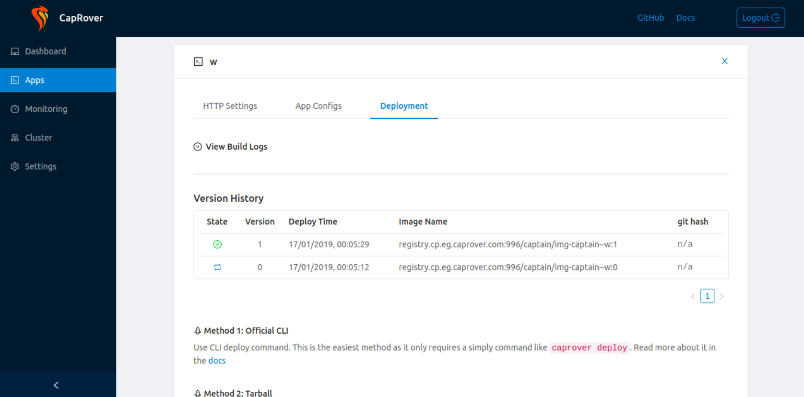

# Caprover Deployment on OCI Free Tier

This Terraform project deploys a CapRover instance in Oracle Cloud Infrastructure (OCI) Free Tier. **CapRover** is an open-source platform to manage your app deployments, offering simple one-click setups for various services.

## Deploy

*Clicking the "Deploy to Oracle Cloud" button will load the Oracle Cloud Resource Manager to deploy the infrastructure described in this Terraform project. During deployment, you'll be prompted to configure the stack parameters. Review the settings, then launch the stack deployment.*

## About CapRover

CapRover is a powerful and easy-to-use platform-as-a-service (PaaS) solution for deploying applications, managing servers, and simplifying DevOps processes. With a user-friendly dashboard, it enables developers to manage multiple applications effortlessly.

For more information, visit the official page at [caprover.com](https://caprover.com).

## OCI Free Tier Overview

Oracle Cloud Infrastructure (OCI) offers a Free Tier with resources ideal for light workloads, such as the VM.Standard.E2.1.Micro instance. These resources are free as long as usage remains within the limits.

For detailed information about the free tier, visit [OCI Free Tier](https://www.oracle.com/cloud/free/).

*Note: Free Tier instances are subject to availability, and you might encounter "Out of Capacity" errors. To bypass this, upgrade to a paid account. This keeps your free-tier benefits but removes the capacity limitations, ensuring access to higher-tier resources if needed.*

## Prerequisites

Before you begin, ensure you have the following:

-   An Oracle Cloud Infrastructure (OCI) account with Free Tier resources available.
-   An SSH public key for accessing the instances.

## Project Structure

-   `bin/`: Contains bash scripts for setting up CapRover on both the main instance and the worker instances.
    -   `caprover-main.sh`: Script to install CapRover on the main instance.
    -   `caprover-worker.sh`: Script to configure necessary dependencies on worker instances.
-   `doc/`: Directory for images used in the README (e.g., screenshots of CapRover setup).
-   `helper.tf`: Contains helper functions and reusable modules to streamline the infrastructure setup.
-   `locals.tf`: Defines local values used throughout the Terraform configuration, such as dynamic values or reusable expressions.
-   `main.tf`: Core Terraform configuration file that defines the infrastructure for CapRover's main and worker instances.
-   `network.tf`: Configuration for setting up the required OCI networking resources (VCNs, subnets, security lists, etc.).
-   `output.tf`: Specifies the output variables such as the IP addresses for the dashboard and worker nodes.
-   `providers.tf`: Declares the required cloud providers and versions, particularly for Oracle Cloud Infrastructure.
-   `README.md`: This file, providing instructions on deployment and usage.
-   `variables.tf`: Defines input variables used in the project, including compartment ID, SSH keys, instance shape, and more.

## Terraform Variables

Below are the key variables for deployment, which can be defined in `variables.tf` or passed during `terraform apply`:

-   `ssh_authorized_keys`: Your SSH public key for accessing the instances.
-   `compartment_id`: OCI compartment ID for instance deployment.
-   `num_worker_instances`: Number of worker instances to deploy for CapRover.
-   `availability_domain_main`: Availability domain for the main instance.
-   `availability_domain_workers`: Availability domains for worker instances.
-   `instance_shape`: Instance shape (e.g., VM.Standard.E2.1.Micro) used for deployment.
-   `memory_in_gbs`: Memory size (GB) per instance.
-   `ocpus`: Number of OCPUs per instance.